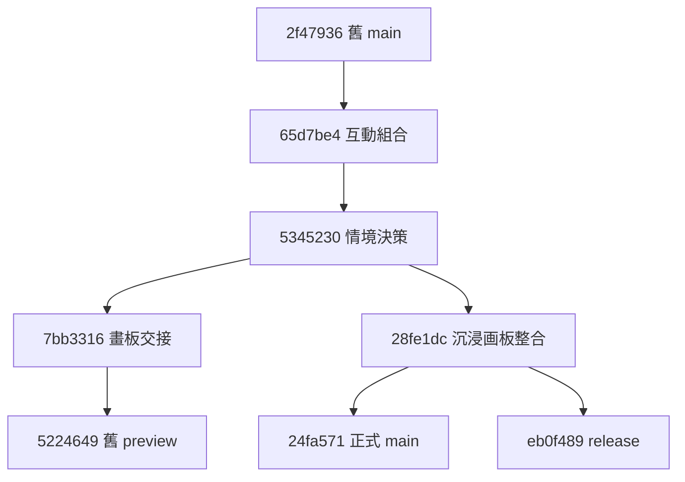

# RallyPath 分支與內容審核 — 2026-09-19

## 結論

唯一來源採用 [demonyang885/tennis-tactics-interactive-preview / main](https://github.com/demonyang885/tennis-tactics-interactive-preview/tree/main)。
不整批 merge 舊分支：互動與決策歷史已包含；release 與 main 內容一致；舊畫板 preview 則保留了較完整的過程文件與部分已被取代的 UI。

本次使用 GitHub API 讀取全部現存分支（兩倉庫共 7 條）、commit parents、recursive trees、compare、PR 和 Actions；以 blob SHA 做**兩端檔案**比較，再閱讀畫板模型、驗證、renderer、media、UI、runtime 與測試的差異。Compare API 的 files 是 merge-base 到 head，不拿它冒充兩端 diff。兩棵 recursive trees 均未 truncated。
未連線 Mac mini，未核查未推送工作，未重跑瀏覽器測試，也未聲稱已讀取線上 version.json。

## 分支去向

| 倉庫 | 分支 | HEAD | 與正式 main 的關係 | 處置 |
|---|---|---|---|---|
| tennis-tactics | main | 2f47936 | 正式 main 的祖先；落後 5 提交 | 歷史基線，停止新功能 |
| tennis-tactics | feature/interactive-combination-rally | 65d7be4 | 正式 main 的祖先；落後 3 提交 | 互動組合已包含，不重複移植 |
| tennis-tactics | feature/signal-anchored-decision-practice | 5345230 | 正式 main 的祖先；落後 2 提交 | 同一情境決策已包含 |
| tennis-tactics | feature/court-canvas-tactics-board | 7bb3316 | preview 的祖先；preview 在其後 15 提交 | 原始交接快照；沒有 preview 之外的獨有檔案 |
| tennis-tactics-interactive-preview | preview/court-canvas-cad0d5f | 5224649 | 與 main 分叉：preview 側 16、main 側 2；共同祖先 5345230 | 保存歷史／設計證據，不整條合併 |
| tennis-tactics-interactive-preview | release/rallypath-v0.1.0 | eb0f489 | 與 main 各有一個提交，但全部檔案 path/blob SHA 相同 | 已發布的候選快照，沒有待搬功能 |
| tennis-tactics-interactive-preview | main | 24fa571 | 9/15 正式發布；build／deploy 成功 | 唯一持續開發基線 |

完整 SHA 與逐檔分類見 [audit manifest](./branch-audit-2026-09-19.json)。
分支先全部保留，不以本表自動刪除；後續若要刪，先核對本次 HEAD 未改變，並建立保留 refs／tag。

## 提交關係

圖中 A→B 與 D→E 省略中間提交。28fe1dc 的 parent 是 5345230，並非 5224649；只能證實內容整合結果，不能把未直接相連的歷史稱作普通 merge。
PR #1 以 squash 產生 24fa571，和候選 eb0f489 指向同一檔案樹：
`83aee24853c23574fb24cc932b076db2acda4b0b`。Git 的 diverged／未合併清單不等於有遺漏內容。

## 哪些仍然有價值

| 內容 | 證據與現況 | 建議 |
|---|---|---|
| 互動組合、情境決策 | 65d7be4、5345230 在正式 main 祖先链 | 保留當前實作；不 cherry-pick 重複提交 |
| 畫板模型、同步回合、上一球路曲線編輯 | main 延續 preview 的模型，新增 restoreStarterBoard 與用途分類；相應測試仍在 | 以 main 繼續，保留一次手勢一次撤銷、同步回放與保守遷移契約 |
| 影片／GIF 本機匯出 | media-core、worker 等 blob 相同；media.ts 差別為輸出名稱改名 | 保留 main，本機生成與分享分開的契約仍重要 |
| Drill 資料與指南 | src/board/drills.ts blob 相同，3 路線 × 4 階段；main 編輯器仍用 drillId/sourceTacticId 顯示指南 | 保留，適合日後練習與回饋迭代 |
| 訓練路線一鍵擺場 | preview 的 decorateDrillBoard 及 3 張 route cards 在 main 移除；並未搬到 BoardLibrary | 有價值的候選功能；記入下文，不當作已存在 |
| 設計與驗收材料 | preview 獨有 17 個文件／圖片，另有較新的 design-qa 和 AGENTS 產品約束 | 本 PR 搬入隔離的歷史目錄，加醒目過期標記 |
| 舊一鍵清除 | main UI 改為還原標準發球站位；保留清空的底層函數與舊空白文件相容測試 | 視為行為變更，不用舊 clear UI 覆蓋現版本 |
| 舊手機外框、五工具列、首頁戰術目錄 | main 已是 frameless、沉浸畫板與畫板優先首頁；對應測試同步變更 | 歷史設計，不回退 |
| 舊模型契約／Mac mini 交接 | 包含尚未實作、先用 feature、舊來源 remote、main 不變等過時描述 | 保存原文作證據，禁止作當前指示 |

本次未找到需要整批合回的獨有程式檔。這不等於宣稱每項 UI 行為完全等價；訓練擺場入口和清空／還原是明確差異。

## 下一輪可恢復：訓練路線一鍵擺場

舊實作從對應戰術建立副本，設定 drillId，加入一個目標區及兩個標誌碟。
[原始函數與入口](https://github.com/demonyang885/tennis-tactics-interactive-preview/blob/5224649d49f3f1c0c49b224d65bd2bee4df91265/src/Prototype.tsx)：
`decorateDrillBoard`、舊 `BoardHome` 的「从完整练习路线开始」。

如要恢復，應放在練習分類的次級入口或模板庫，不能佔用首頁首屏；
新文件明確標為 `purpose: "practice"`，並遵守未實際編輯不落存檔。
以 main 的 adapters／validation／儲存規則重接，避免直接貼回舊 BoardHome。
本 PR 記錄這個候選，不自行新增產品功能。

## 保存策略與過期指示修正

- [歷史目錄](../archive/README.md) 收錄 preview 的 docs/court-board 圖片與文件、舊交接、QA 和 agent 產品記錄。
- 圖片直接保留原 blob；Markdown 加過期警告、原始 commit 來源。原 AGENTS 另命名 historical-agent-notes.md，避免成為有效開發指令。
- 更早 feature 的 IMPLEMENTATION／AGENTS 可透過固定 SHA 查閱，無需把每個舊文案版本放進現行目錄。
- 根 README 與 AGENTS 指向 SOURCE_OF_TRUTH.md；PRODUCT_VNEXT、product-audit、design-qa 加上歷史範圍提示。
- 配套舊倉庫 PR 在 README／AGENTS 開頭指向新入口。該 PR 合併前，舊 main 文件仍可能誤導。
- 不改部署、網站路徑、package version、存檔鍵或 app 程式；不刪 branch、不 force-push。

## 驗證與限制

9/15 [發布 PR](https://github.com/demonyang885/tennis-tactics-interactive-preview/pull/1) 報告 Playwright 124/124；
本次實際核對 [Actions build/deploy](https://github.com/demonyang885/tennis-tactics-interactive-preview/actions/runs/34946384862) 各步成功，未在本機重跑 124 個測試。
此次文件變更以 Git tree 確認 app／測試／workflow／runtime／lock blob 不變、archive 資產保持原 SHA、Markdown 相對檔案連結有效。
新 PR 的當次 CI 結果另以 PR checks 為準，不能把歷史成功當成新 PR 已過。

兩倉庫 Releases 為空；發布倉庫 matching tag refs 為空。不要將 release 分支當成不可變 tag。
兩個 main 的 branches API 回報 protected:false；未完整驗證 rulesets，不能聲稱已設置強制 PR／required checks。
未檢查 Mac mini 本地未推送分支及未提交檔案；下一次接手須依 SOURCE_OF_TRUTH 的開工檢查進行。
